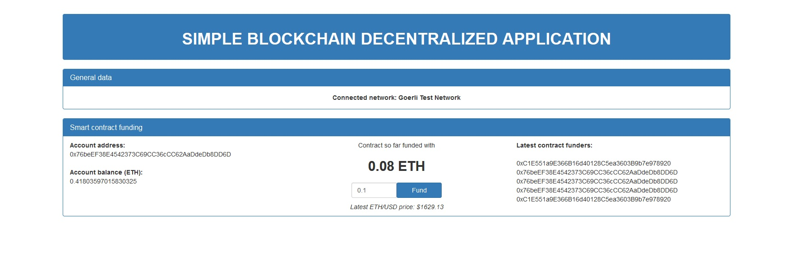

# Simple Blockchain Dapp

This simple blockchain decentralized Angular application is a showcase on how to create smart contracts on blockchain and interact with them through web3 applications. In this app You can fund a real smart contract with some fake ETH from Your MetaMask wallet. Smart contracts exist on Goerli Testnet Network but You can also use Ganache (local blockchain) to interact with those same smart contracts. For demonstration and learning purposes only!

Feel free to use or modify this code in any way you like.

## Installing

```bash
cd simple-blockchain-dapp
npm install
```

## Getting started

As this application was written in Typescript (Angular), You can start it like so:

```bash
ng serve
```

Smart contract are already deployed to Goerli Testnet Network but You can deploy them to Ganache with truffle:

```bash
truffle migrate
```

Note that we avoided any arguments with this command. In that case smart contracts will be deployed to Ganache by default. Of course, Your Ganache has to be up-and-running and ready for smart contracts to be deployed successfully.

On the other hand, if You use a _`--network`_ argument, contracts will be deployed to that network:

```bash
truffle migrate --network goerli
```

If You want to redeploy or create some new smart contracts to "real" testnet networks like Goerli, You will have to provide MNEMONIC for Your MetaMask accounts and INFURA-KEY (if You use Infura) in _`truffle-config.js`_ located in the root of this project.

## Usage

This application works with two testnet networks: Goerli Testnet Network and Ganache (local blockchain). Choose Your preferred test network in MetaMask (e. g. Goerli) with one or more accounts that already have some fake ETH, connect site to MetaMask, in application input some ETH amount into the inputbox and click _`Fund`_ button next to it. Observe how Your account balance decreases by that fund amount and how Your address appears in the _`Latest contract funders`_ list on the right hand side. At the same time the smart contract's balance increases by the same amount. When transaction completes, a short message will be visible for a few seconds to inform You of completition.

If You use a "real" testnet network (e. g. Goerli) as opposed to a local blockchain Ganache, You should see all Your successful transactions on Ethercan. For Goerli Testnet Network it can be found [here](https://goerli.etherscan.io/). Search Etherscan by typing Your account address and You will see all transactions in detail in which that account address was involved.

You can obtain some fake ETH into Your account for Goerli Testnet Network [here](https://goerlifaucet.com/).

This code is also a good example on how to use Chainlink for decentralized applications to be able to communicate with "outside data". This application uses _`AggregatorV3Interface`_ to get latest ETH/USD price.

## Live application

This application is live on the cloud and can be seen [here](https://simple-blockchain-dapp.web.app/).

### Screenshot


